# APT Casino - Yellow Network Diagrams (ERC-7824 Only)

## 🌐 On-Chain Working with Yellow State Channels

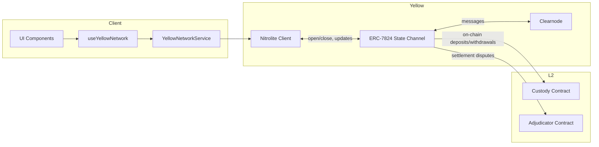

## 🔌 Channel Creation (Open State Channel)

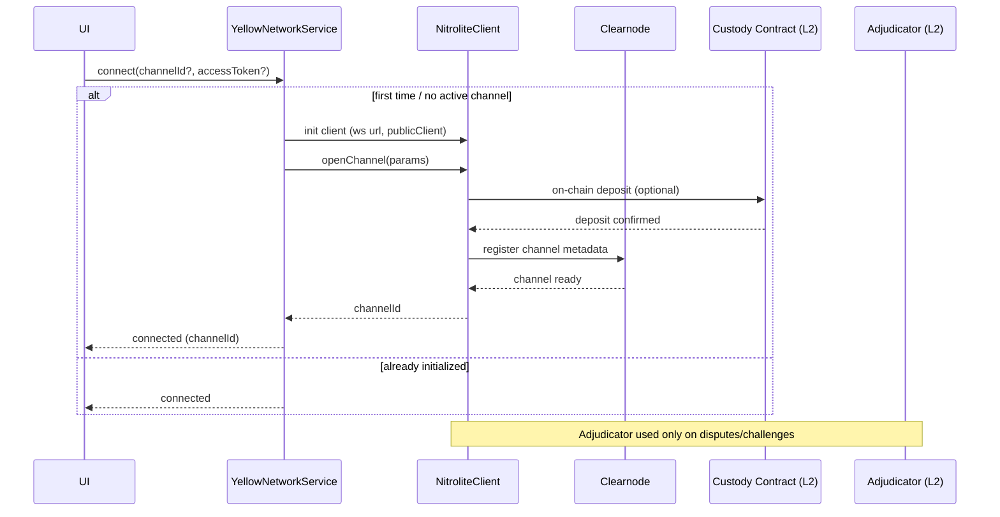

## 🎮 Session Creation (Game Session Lifecycle)

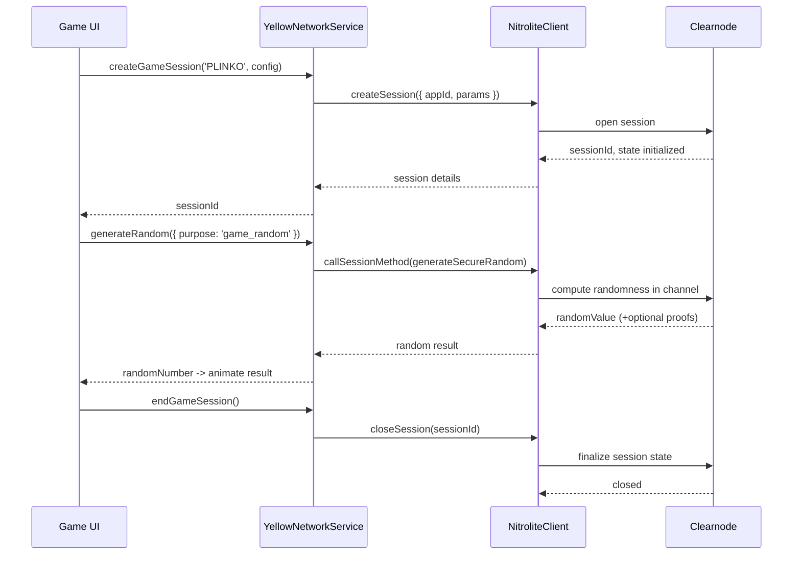

## 💳 Deposit / Withdraw via State Channel

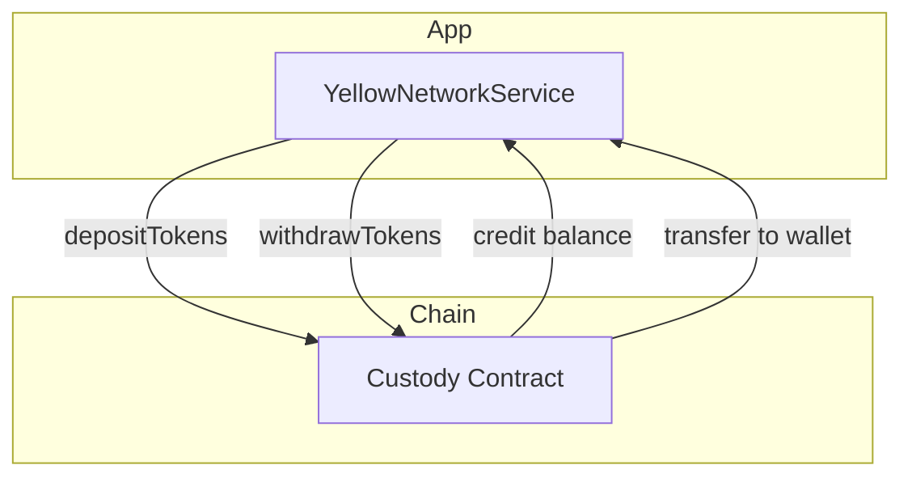

## ⚖️ Dispute & Settlement (High-Level)

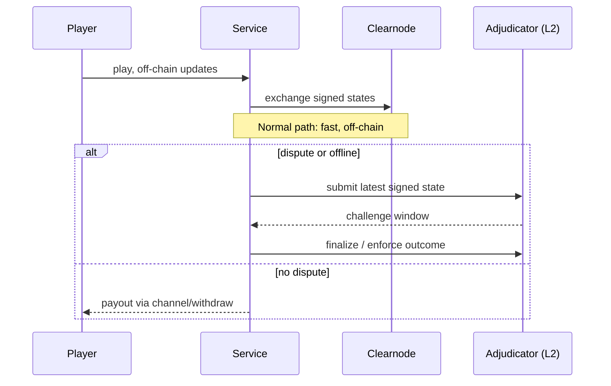

## 🎮 Game Play Flows over Channels (Mines, Plinko, Roulette, Wheel)

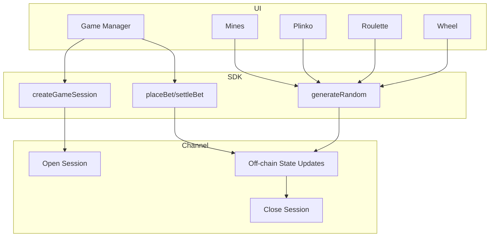

### Mines Round (detailed)
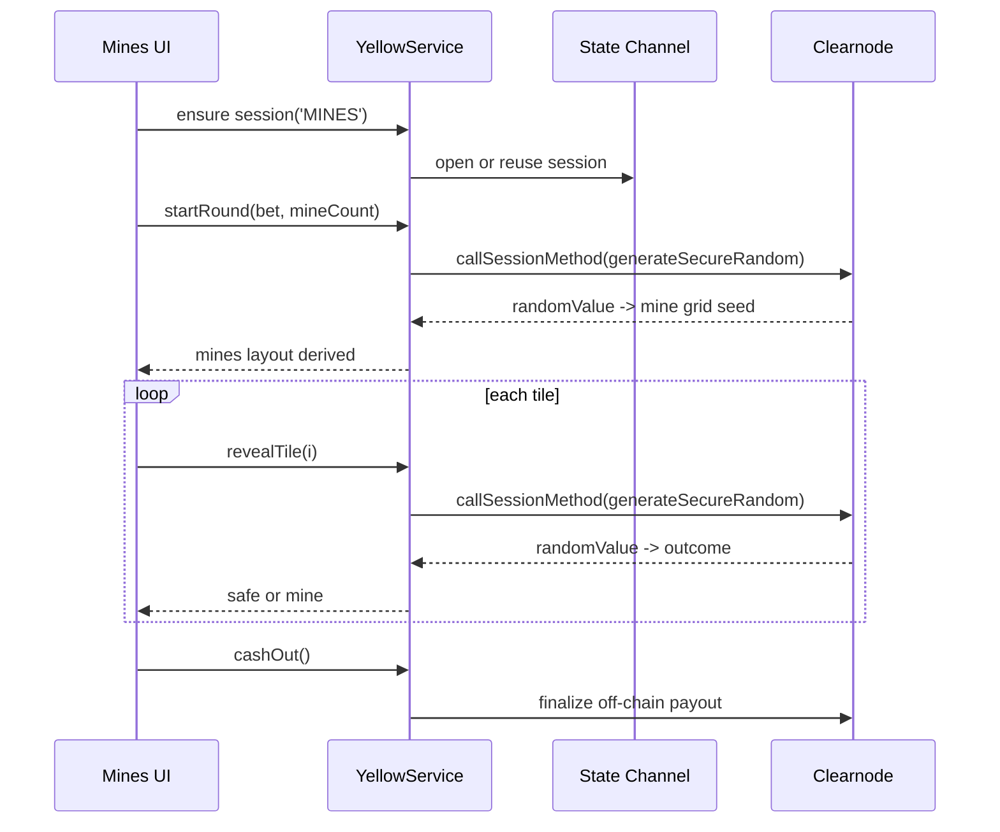

### Plinko Drop (detailed)
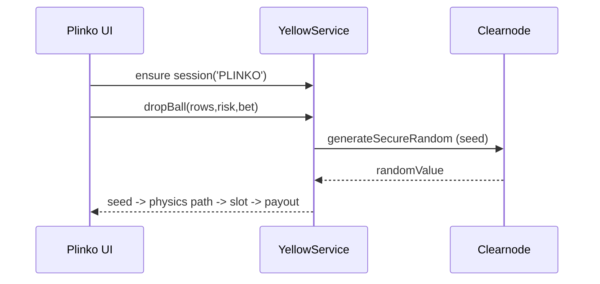

### Roulette Spin (detailed)
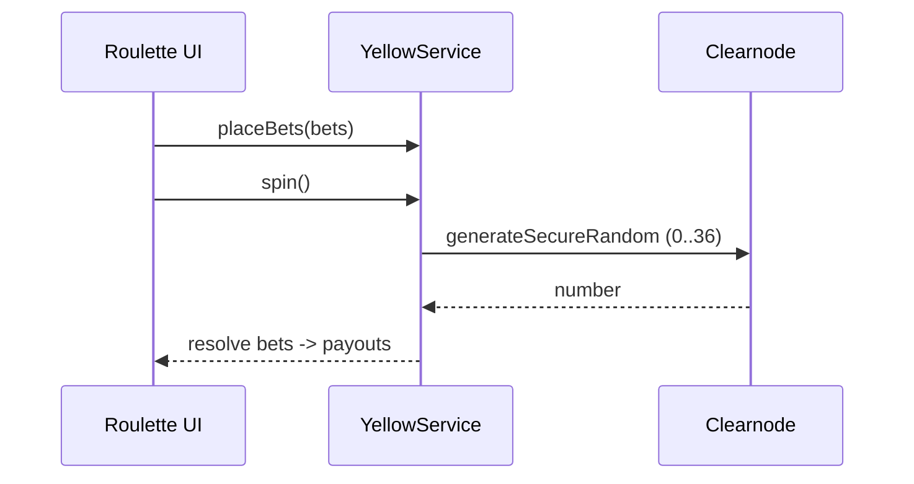

### Wheel Spin (detailed)
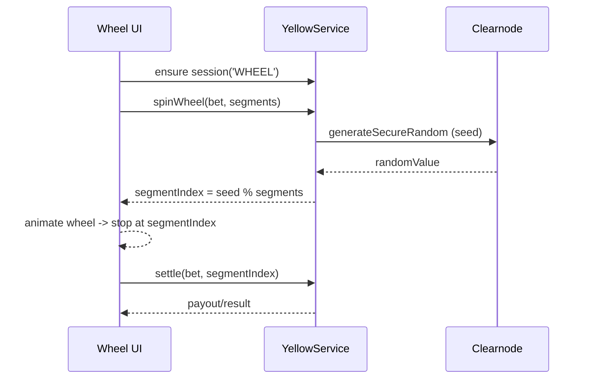

## 🔊 Chain Listener & Session On-chain TX (Arbitrum Sepolia)

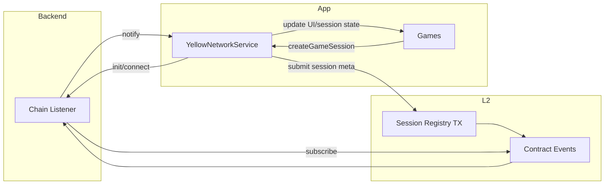

### Listener Sequence (Session Submit + Confirm)
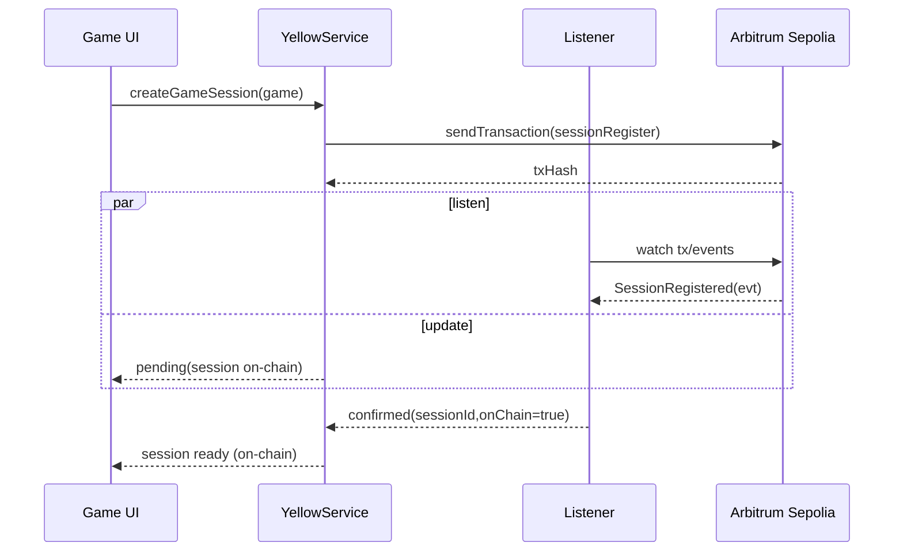
